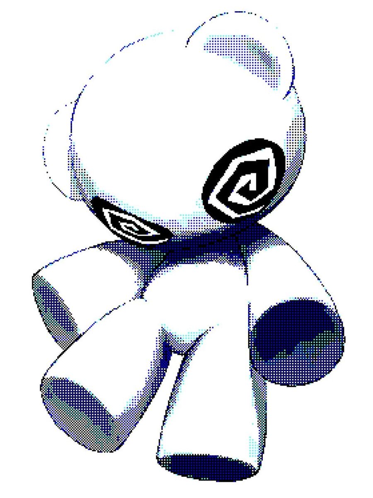
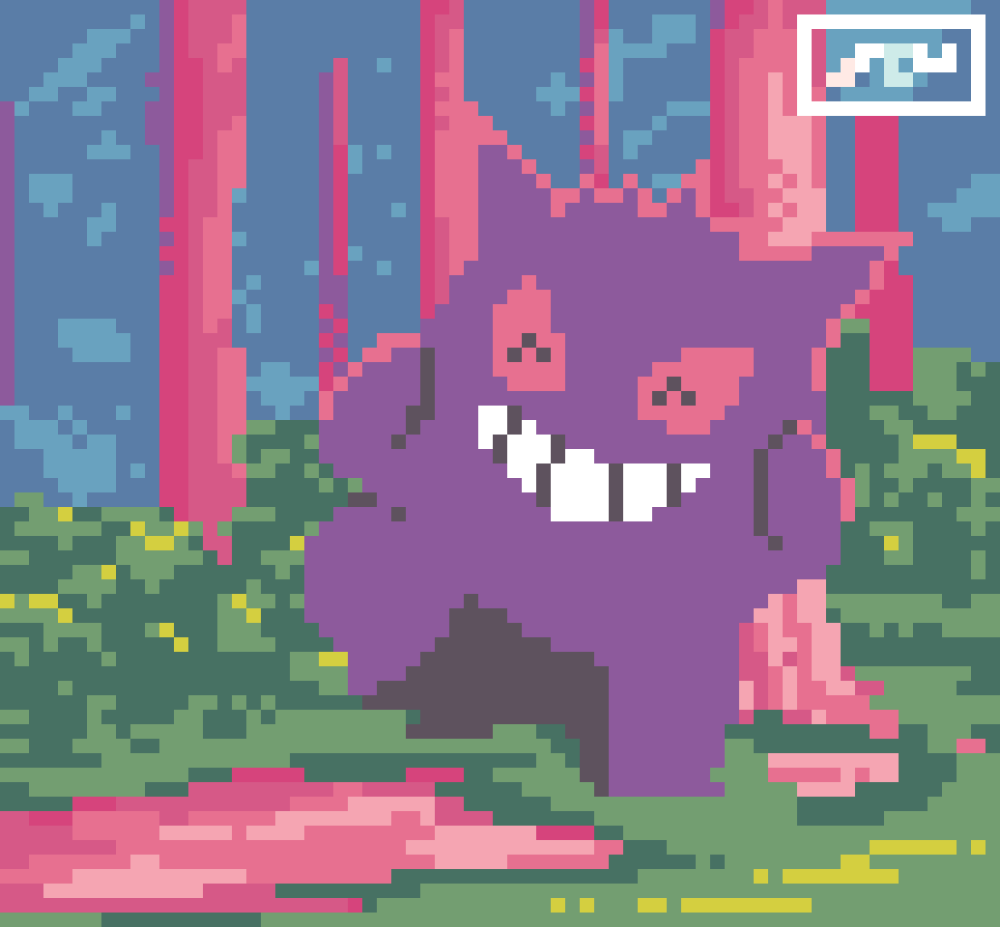

  
<pre>
    🎓 Student at Cesar School • Backend and Game Dev Enthusiast
    🖥️ C, Java, and aspiring Rustacean • Backend & Game Dev Focus
    🕹️ Pokémon Trainer (Gengar main) • Formula 1 Fan (Forza Ferrari!)
    🍳 Cooking enthusiast • Full stack aspirations
</pre>
  

   

